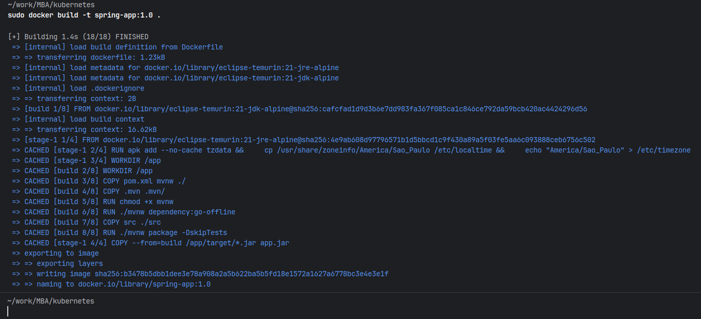
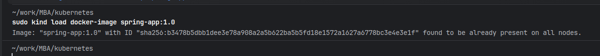
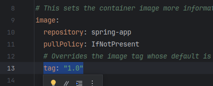
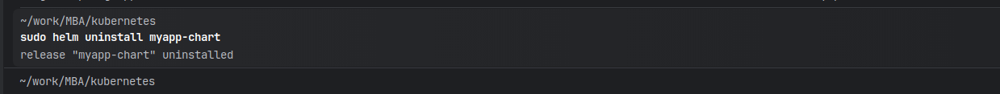
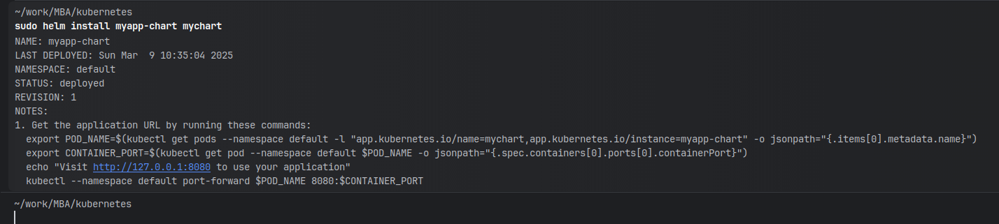

# Este projeto foi desenvolvido utilizando spring boot, docker, kubernetes, kind e helm

## Para rodar o projeto é necessario ter instalado as ferramentas abaixo:
- Java 21
- Docker
- Kind (https://kind.sigs.k8s.io/docs/user/quick-start/)
- Helm (https://helm.sh/pt/docs/intro/install/)

## Faça o clone do projeto
```
git clone https://github.com/claudemirferreira/kubernetes.git
```

## Gera uma nova versão
```
mvn clean install
```

## Gerar a imagem
```
sudo docker build -t spring-app:1.0 .
```


## Enviar a imagem para kind
```
sudo kind load docker-image spring-app:1.0
```


## Atualizar a tag
- No arquivo mychart/values.yaml atualizar a tag que foi gerada no passo anterior




## Desinstala myapp-chart se existir uma instalação
```
sudo helm uninstall myapp-chart
```


## Instala o mychart
```
sudo helm install myapp-chart mychart
```


## Faz o port-forward para liberar os teste via swagger
```
sudo kubectl port-forward svc/myapp-chart-mychart 8080:8080
```

## acessar swagger
```
http://127.0.0.1:8080/swagger-ui/index.html#/transferencia-controller/addClient
```

## Comandos uteis

kubectl get all

kubectl get pods

kubectl get service 

## Instalar o mysql 

- Adicionar o Repositório do Helm
```
sudo helm repo add bitnami https://charts.bitnami.com/bitnami
sudo helm repo update
```

- Instalar o MySQL Usando o Helm
```
sudo helm install my-mysql bitnami/mysql
```

- Configurar a Senha do Banco de Dados
```
sudo helm install my-mysql bitnami/mysql --set mysqlRootPassword=minhasenha
```

Verificar a Instalação do MySQL
```
sudo kubectl get pods
```

- Obter o Endereço do Serviço
```
kubectl get svc my-mysql
```


sudo kubectl get secret --namespace default my-mysql -o jsonpath="{.data.mysql-root-password}" | base64 --decode

L8hEnXqrsQ
